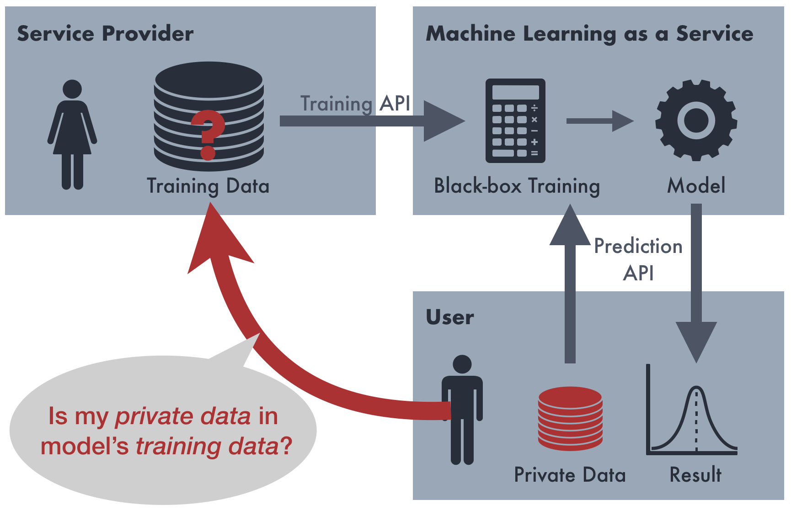
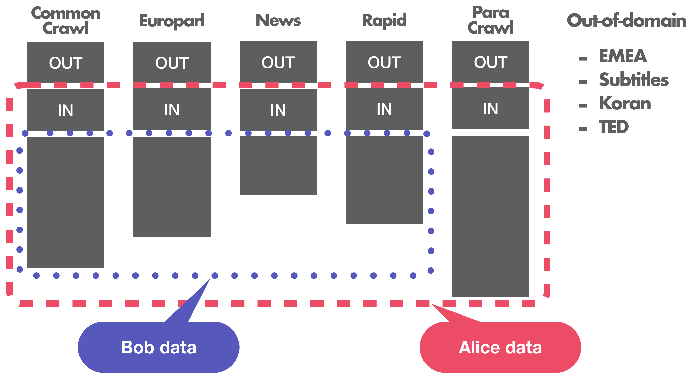
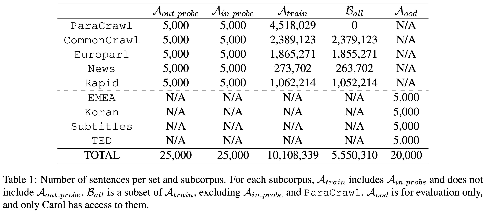

# Membership Inference Attacks on Sequence-to-Sequence Models

Public data from the paper "*Membership Inference Attacks on Sequence-to-Sequence Models*" (Sorami Hisamoto, Matt Post, Kevin Duh, 2019).

https://arxiv.org/abs/1904.05506





## Data

### Directory

We have two main directories, `alice/` and `bob/`, for Alice and Bob.

For `alice/`, we have four subdirectories, MT model training data (`train/`), **in probes** (`in_probe/`), **out probes** (`out_probe/`), and **out-of-domain probes** (`ood/`). In each probe subdirectories, there are `original/` for the original corpus data, and `mt/` which contains the translation text file (`*.de-en.en`) and the MT model score file (`*.de-en.score.en`) from the Alice MT model.

```
alice
|-- in_probe
|   |-- mt
|   `-- original
|-- ood
|   |-- mt
|   `-- original
|-- out_probe
|   |-- mt
|   `-- original
`-- train
```

For `bob/`, we have `all/` for the entire data Bob gets that he can use for whatever way he wants for his attacks. We also have 10 subdirectories `shadow_{1..5}{a,b}/` from the "shadow models" we used for the attacks in our experiments. Similar to Alice each shadow model subdirectory contains `train`, `in_probe/`, `out_probe/`, and `ood`, and each probe subdirectories contain both `original/` and `mt/`.

```
bob
|-- all
|-- shadow_1a
|   |-- in_probe
|   |   |-- mt
|   |   `-- original
|   |-- ood
|   |   |-- mt
|   |   `-- original
|   |-- out_probe
|   |   |-- mt
|   |   `-- original
|   `-- train
|-- shadow_1b
|   |-- in_probe
|   |   |-- mt
|   |   `-- original
...
```

### File name

Each terminal subdirectories contain text files (and MT model score files if applicable). The file name indicates the subcorpus, file type, and the language.

For example, `commoncrawl.de-en.tok.de` is a CommonCrawl (`commoncrawl.de-en`) tokenized (`.tok`) German (`.de`) data. 

- Subcorpus
  - Main Subcorpora
    - `paracrawl.filtered`
    - `commoncrawl.de-en`
    - `europarl-v7.de-en`
    - `news-commentary-v13.de-en`
    - `rapid2016.de-en`
  - Out-of-Domain Subcorpora
    - `emea.de-en`
    - `koran.de-en`
    - `subtitles18.de-en`
    - `ted.de-en`
- File Type
  - `.tok`: Tokenized text
  - `.score`: MT model score
- Language
  - `de`: German (source)
  - `en`: English (target)
  
All text are tokenized. We used the same tokenziation for both Alice and Bob.


## Detail of Data Splits

## Corpus



For our experiment, we had 5 main subcorpora. We used corpora from the Conference on Machine Translation (WMT18) ([Bojar et al., 2018](https://www.aclweb.org/anthology/W18-6401/)). 

Carol, the judge, gives Alice 4 subcorpora as her MT model training data, namely `CommonCrawl`, `Europarl v7`, `News Commentary v13`, and `Rapid 2016`. Carol excludes 5,000 samples from each training sets as *out probes*, and select 5,000 samples within the training sets as *in probes*. 

Bob gets a subset of the data Alice has, excluding Alice *in probes*. He can use this data in whatever way he wants for his attack.

In addition, Carol gives Alice `ParaCrawl`, but not to Bob. We can think of it  as an in-house data the MT service provider holds. 


## Out-of-domain Subcorpora

Additionally, we have 4 out-of-domain (OOD) subcorpora, namely `EMEA` and `Subtitles 18` ([Tiedemann, 2012](https://www.aclweb.org/anthology/L12-1246/)), `Koran` (Tanzil), and `TED` ([Duh, 2018](http://www.cs.jhu.edu/~kevinduh/a/multitarget-tedtalks/)).


## Size



